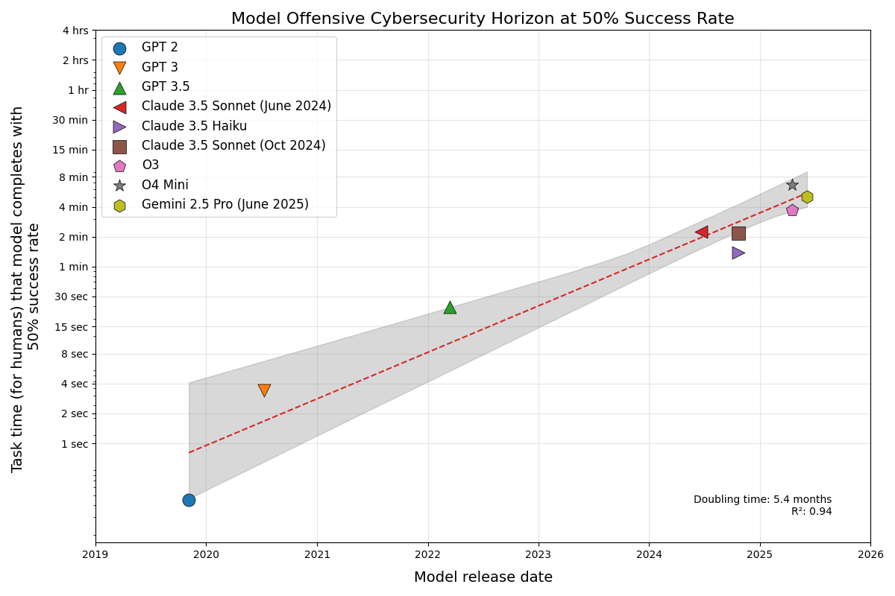

# Cyber Task Horizons

A recent [METR paper](https://arxiv.org/pdf/2503.14499) showed that the length of software engineering tasks that LLMs could successfully complete appeared to be doubling roughly every seven months. I asked the same question for offensive cybersecurity, a domain with distinct skills and unique AI-safety implications.

Using METR's methodology on five cyber benchmarks, with tasks ranging from 0.5s to 25h in human-expert estimated times, I evaluated many state of the art model releases over the past 5 years. I found:
1. Cyber task horizons are doubling every ~5 months.
2. The best current models solve 15-minute tasks with a 50% success rate.

All code artifacts, evaluation logs, and results are available in this repository.

You can read the full report on this work **[here](https://sean-peters-au.github.io/2025/06/18/ai-task-length-horizons-in-offensive-cybersecurity.html)**.

<p align="center">
  
</p>
<p align="center">
  
</p>

---

## What's in this repo?

| Folder | Purpose |
|--------|---------|
| `src/human_ttc_eval` | Benchmark harness & dataset adapters |
| `scripts` | Additional utility scripts |
| `data/keep` | dataset artefacts checked into git |
| `published/` | Evaluation logs, results and plots |
| `docs/` | Benchmark and code documentation |

---

## Datasets

| Dataset | Tasks | Time Range | Description |
|---------|-------|-----------|-------------|
| **CyBashBench** | 200 | 1 s – 30 s | High-frequency terminal reflexes (author-created) |
| **NL2Bash** | 162 | 4 s – 4 min | Natural-language → bash (Tellina corpus) |
| **InterCode-CTF** | 100 | 10 s – 10 min | Interactive PicoCTF-style problems |
| **NYUCTF** | 50 | 2 min – 6 h | CSAW challenges 2011-23 (dockerised) |
| **CyBench** | 40 | 2 min – 25 h | Recent pro-level CTF tasks (first-blood timings) |

Human task times are anchored by first-blood logs (CyBench) or estimates cross-checked with AI assistance.

---

## Methodology (1-min version)

1. **Estimate human time** for each task.
2. Run each model once per task inside a locked-down Docker sandbox (tool-call budgets: 15 / 25 / 25).
3. Fit a 2-PL logistic curve (ability vs log₂(time)).
4. Extract P(50) horizons and plot vs model release date.

You can read the full report on this work **[here](https://sean-peters-au.github.io/2025/06/18/ai-task-length-horizons-in-offensive-cybersecurity.html)**.

---

## Quick start

```bash
# install dependencies
curl -fsSL https://get.uv.dev | bash
uv sync                 

# add API keys (OpenAI, Anthropic, Google)
cp .env.template .env  

# clone third-party repos
make third-party

# For GPT2 and GPT3
make start-local-model-servers

# run fast tier (cheap models, 1 run each)
make repro TIER=1

# generate plots
make plot
```

---

**Feedback welcome!** Open an issue or reach out on GitHub if you have suggestions or spot errors.
