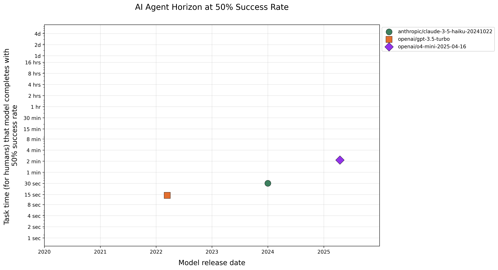

# Cyber Task Horizons

A cybersecurity AI evaluation framework implementing [METR's time horizon analysis](https://arxiv.org/abs/2503.14499) across 5 datasets spanning 0.6 seconds to 25 hours of expert completion time.

## Results

### AI Capability Progression Across Time Horizons


<div align="center">
  
  
</div>

## Overview

This framework evaluates AI models on cybersecurity tasks using [METR's time horizon methodology](https://arxiv.org/abs/2503.14499). By plotting AI success rates against increasing task complexity (measured by expert completion time), we can visualize capability progression and identify critical threshold crossings.

This is a personal learning and research project aimed at understanding AI cybersecurity capabilities across different time horizons, reproducing METR's methodology in the cybersecurity domain, and exploring capability thresholds that may indicate concerning AI progress.

**Key Features:**
- **5 Cybersecurity Datasets**: Command reflexes to professional CTF challenges
- **Time Horizon Analysis**: 0.6s to 25h expert completion times
- **METR-Compatible**: Direct integration with METR's analysis tools
- **Sandboxed Evaluation**: Docker-based secure environments
- **Horizon Curves**: Capability progression visualization

## Quick Start

```bash
# Setup
curl -fsSL https://get.uv.dev | bash
uv sync
cp .env.template .env  # Add your API keys
make third-party

# Start local model server
make start-local-model-server MODEL=openai/gpt2-xl

# Run evaluation (in new terminal)
make repro TIER=1
```

See [Usage Guide](docs/usage.md) for detailed instructions.

## Datasets

| Dataset | Tasks | Time Range | Source | Description |
|---------|-------|------------|---------|-------------|
| **CyBashBench** | 131 | 0.6s-15s | Author-created | Cybersecurity command reflexes |
| **NL2Bash** | 136 | 4s-4min | [TellinaTool](https://arxiv.org/abs/1802.08979) | Natural language to bash translation |
| **InterCode-CTF** | 99 | 10s-10min | [InterCode](https://arxiv.org/abs/2306.14898) | Interactive CTF challenges |
| **NYUCTF** | 50 | 2min-6h | [NYU CTF Dataset](https://arxiv.org/abs/2406.05590) | University competition challenges |
| **CyBench** | 40 | 2min-25h | [CyBench](https://arxiv.org/abs/2408.08926) | Professional CTF challenges |

## Documentation

- **[Quick Start](docs/usage.md)** - Get up and running quickly
- **[Methodology](docs/methodology.md)** - METR integration and evaluation approach
- **[Datasets](docs/datasets.md)** - Comprehensive dataset overview
- **[Architecture](docs/architecture.md)** - Technical implementation details

Individual dataset documentation:
[CyBashBench](docs/cybashbench.md) | [NL2Bash](docs/nl2bash.md) | [InterCode-CTF](docs/intercode_ctf.md) | [NYUCTF](docs/nyuctf.md) | [CyBench](docs/cybench.md)

## Important Limitations

**Human Baselines**: Most human timing data are AI-assisted estimates rather than empirical measurements. Only CyBench uses real competition data (with timing contamination issues). See [Methodology](docs/methodology.md) for details.
